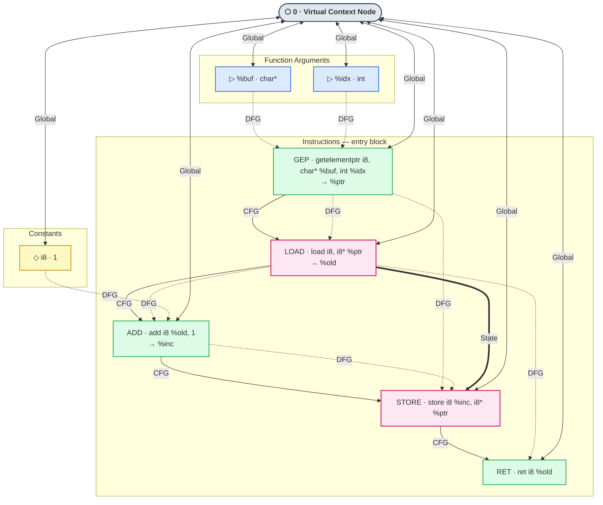

# Instruction-Level IR Graph Structure

Visual reference for the graph representation built by `preprocess_instr_v3.py` (§14).
Each C function is compiled to LLVM IR and converted to a multi-relational graph
with four edge types passed to an RGCN classifier.

---

## Example: `char read_and_write(char *buf, int idx)`

```c
char read_and_write(char *buf, int idx) {
    char old = buf[idx];      // load
    buf[idx] = old + 1;       // store — same pointer as load
    return old;
}
```



---

## Node Types

| Color | Type | Description | Vocab ID |
|---|---|---|---|
| Grey | Virtual Context Node | One per graph; global hub reducing diameter to O(1) | 0 |
| Blue | Function Argument | One node per function parameter | 1 |
| Yellow | Constant (int/fp) | Literal values; carry Perfograph magnitude encoding | 76 / 77 |
| Green | Instruction | Most IR instructions (GEP, ADD, RET, icmp, br, …) | 2–74, 80–105 |
| Pink | Memory instruction | `load` and `store` — highlighted because they participate in State edges | 27 / 28 |
| — | Call target (Alloc) | malloc, calloc, realloc, … | 106 |
| — | Call target (Copy) | memcpy, memmove, memset | 107 |
| — | Call target (String) | strcpy, sprintf, gets, … | 108 |
| — | Call target (FileIO) | fopen, read, write, … | 109 |
| — | Call target (Network) | recv, send, accept, … | 110 |

---

## Edge Types

| Type | Arrow | Relation ID | What it encodes |
|---|---|---|---|
| CFG | solid `→` | 0 | Sequential instruction execution; inter-block branch targets |
| DFG | dashed `⤳` | 1 | SSA def-use: each instruction's result flows to instructions that consume it |
| Global | double `↔` | 2 | Virtual Context Node to every other node (bidirectional); collapses graph diameter to O(1) so a local patch propagates in two message-passing steps |
| State | thick `⟹` | 3 | Memory operation ordering: consecutive `load`/`store` pairs on the same pointer, in execution order |

---

## Why the State edge matters

DFG already connects `GEP → LOAD` and `GEP → STORE` because both use `%ptr` as an
operand. What DFG does *not* encode is their ordering relative to each other. The State
edge `LOAD ⟹ STORE` is the first edge type that says: **this memory location was read,
then written**.

In a use-after-free scenario the pattern is reversed — the pointer is freed between the
load and the store, but the graph topology of the load/store pair is identical to the safe
case. State edges give the RGCN a distinct relation to learn from, rather than routing
all memory semantics through the same DFG weight matrix.

---

## Mapping to the model

```
preprocess_instr_v3.py          train_instr_v3.py
────────────────────────        ─────────────────────────────────────
Pass 1 — allocate nodes    →    nn.Embedding(111, 128)  # opcode ID
Pass 2 — CFG edges (0)     →    RGCNConv(129, 64, num_relations=4)
Pass 3 — DFG edges (1)     →    RGCNConv( 64, 64, num_relations=4)
         + Perfograph mag   →    x[:,1] appended after embedding
Pass 4 — Global edges (2)  →    relation weight matrix W_2
Pass 5 — State edges (3)   →    relation weight matrix W_3  ← §14
```

Full experiment log: [`docs/ir-embed.md`](ir-embed.md)
